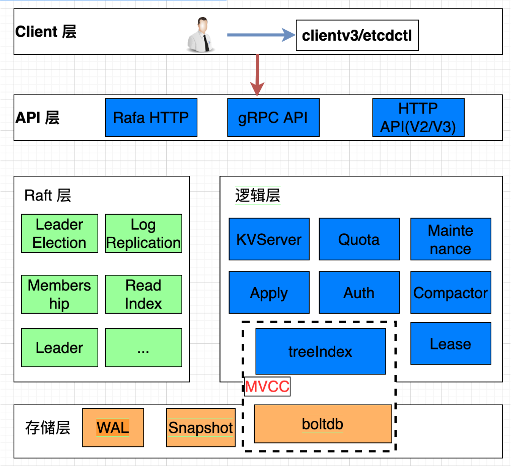

  <h1 align="center">etcd 分布式键值存储系统</h1>
  

    <a href="README.md"><strong>English</strong></a> | <strong>简体中文</strong>
  

## 目录

- [仓库简介](#项目介绍)
- [前置条件](#前置条件)
- [镜像说明](#镜像说明)
- [获取帮助](#获取帮助)
- [如何贡献](#如何贡献)

## 项目介绍
‌[etcd‌](https://github.com/etcd-io/etcd) etcd 是一个开源的 分布式键值存储系统，由 CoreOS 团队开发，现为 CNCF（云原生计算基金会） 毕业项目（与 Kubernetes、Prometheus 同级）。它专门用于存储和管理分布式系统中的关键配置数据，并提供 强一致性、高可用性和可靠性，是 Kubernetes 等云原生系统的核心组件。

**核心特性：**
1. 分布式键值存储：etcd 是一个高性能、分布式的键值存储系统，采用树形结构组织数据（类似文件系统目录），支持字符串、JSON、YAML 等多种数据格式。例如 /registry/services/specs/nginx 可存储 Kubernetes 服务的配置信息。数据通过 gRPC/HTTP API 进行操作，提供强一致性的读写能力。
2. Raft 一致性算法：基于 Raft 算法实现分布式一致性，所有数据变更通过 Leader 节点同步到 Follower 节点，确保集群内数据强一致。支持自动 Leader 选举、日志复制和故障恢复，通常部署奇数节点（如 3、5 个）以容忍 (N-1)/2 个节点故障。
3. 租约（Lease）与 TTL 机制：提供租约（Lease）功能，可为键值对绑定生命周期（TTL），到期自动删除。例如 Kubernetes 使用 Lease 机制检测 Node 心跳，若节点失联则自动触发 Pod 重建。支持租约续期（KeepAlive），适用于服务注册、分布式锁等场景。
4. 事务操作（Transactional Operations）：支持原子性事务，可组合多个条件判断（Compare）和操作（Then/Else）为单一事务。例如 IF version=1 THEN update data ELSE fail，避免并发修改冲突。事务基于 MVCC（多版本并发控制）实现，隔离性强。
5. Watch 监听机制：允许客户端监听键或目录的变化（增删改），通过事件驱动机制实时获取变更。例如 Kubernetes Controller 通过 Watch etcd 监听资源状态变化，实现声明式 API 的自动化协调。支持历史事件回溯和断点续传。
6. 多版本并发控制（MVCC）：每个键的修改会生成递增的版本号（Revision），保留历史版本数据，支持按版本号查询快照。例如可获取 /foo 键在过去某时刻的值，适用于审计、回滚等场景。数据压缩（Compaction）可清理旧版本以节省空间。
7. 高性能与低延迟：优化后的存储引擎（BoltDB）支持每秒数万级写入，读写延迟在毫秒级。通过批量提交、流水线化和异步机制提升吞吐量，适合作为 Kubernetes 等系统的核心元数据存储。
8. 安全与访问控制：支持 TLS 加密通信、客户端证书认证，以及基于 RBAC 的细粒度权限控制。可定义用户（User）、角色（Role）和资源权限（如 etcdctl role grant --path /foo/* --readwrite），确保敏感数据安全。
9. 集群管理与运维友好性：提供成员管理（Member API）、健康检查、快照备份/恢复等功能。支持动态调整集群节点（etcdctl member add），运维工具链完善（如 etcdctl、etcd-operator）。
10. 与 Kubernetes 深度集成：作为 Kubernetes 的默认元数据存储，持久化存储 Pod、Service、ConfigMap 等资源的状态信息，是 K8s 控制平面的核心组件，保障集群高可用和一致性。
11. 跨平台与轻量级：单节点可运行，容器化部署便捷（官方提供 Docker 镜像），资源占用低（基础场景内存约 100MB），支持 Linux/Windows/macOS 等多平台。

本项目提供的开源镜像商品 [**`etcd-分布式键值存储系统`**]()，已预先安装 etcd 软件及其相关运行环境，并提供部署模板。快来参照使用指南，轻松开启“开箱即用”的高效体验吧。

**架构设计：**

> **系统要求如下：**
> - CPU: 4vCPUs 或更高
> - RAM: 16GB 或更大
> - Disk: 至少 50GB

## 前置条件
[注册华为账号并开通华为云](https://support.huaweicloud.com/usermanual-account/account_id_001.html)

## 镜像说明

| 镜像规格                   | 特性说明 | 备注 |
|------------------------| --- | --- |
| [etcd3.6.0-arm-v1.0]() | 基于鲲鹏服务器 + Huawei Cloud EulerOS 2.0 64bit 安装部署 |  |

## 获取帮助
- 更多问题可通过 [issue](https://github.com/HuaweiCloudDeveloper/etcd-image/issues) 或 华为云云商店指定商品的服务支持 与我们取得联系
- 其他开源镜像可看 [open-source-image-repos](https://github.com/HuaweiCloudDeveloper/open-source-image-repos)

## 如何贡献
- Fork 此存储库并提交合并请求
- 基于您的开源镜像信息同步更新 README.md